# Healthcare Tech: A Primer
### Preface
This is a collection of my reflections after ~10 years in the U.S. healthcare tech industry. During that time I've worked on a wide range of applications:
* Social networks for doctors at a 4 person startup, forMD
* Artificial intelligence applications as a software engineer at Watson Health & IBM Research
* Full-scale electronic health record (EHR) software:
  * Tech lead and Staff Software Engineer at [Haven Healthcare](https://en.wikipedia.org/wiki/Haven_Healthcare)
  * Sr. Engineering Manager at [Carbon Health](https://carbonhealth.com/)

I'm proud to know that what I've built has served hundreds of providers and hundreds of thousands of patients across the U.S. I've learned that there's no single make-or-break technical problem to solve in healthcare, but there are a lot of sharp, brittle pieces to put together. Unless we make the technical challenges accessible, my fear is we will keep reinventing the wheel and make only small advances. 

"Healthcare is hard" is the mantra in the industry, with underlying tech being no exception. A big motivation for writing this is a hope that future builders and engineers can learn from, be inspired by, and continue to persevere in this field. It has been rewarding, but difficult working in the byzantine and antiquated healthcare system; hopefully some of these experiences can pave the way for others to keep pushing the needle.
## Healthcare Applications and Use Cases
There are a plethora of applications to be built in healthcare. Some have great market fit, others may be boring but profitable, and yet others are neither highly in demand nor profitable. Here are many such applications I've worked on, with some technical suggestions and notes. 
### Virtual (Urgent/Primary) Care

Virtual care involves the administration of healthcare services across video between a provider and patient. Particularly popular in the late 2010s, especially [during and after the COVID-19 pandemic](https://www.ncbi.nlm.nih.gov/pmc/articles/PMC9035352/).

Inherent to this kind of application is the technical ability to schedule and make video calls. Some considerations include link generation, session management, multi-platform support, session security, and audio/visual data retention of the clinical encounter. 

(In-app) Messaging systems are a common component of healthcare provider and patient interaction, but critical for virtual care. Asynchronous messaging, alerts/notifications, prioritization are key components that need to be considered by an implementer.

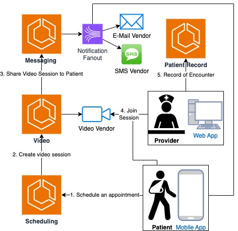

*Overview of key virtual care components*

Scheduling is also a friction point in virtual care. It's a crucial component for any healthcare setting and being able to adjust scheduling both for providers and patients; provider time is at a premium and optimizing patient encounter throughput benefits everyone (and the business’ bottom line).

### Care Teams
In some settings there is a concept of a "[care team](https://www.elationhealth.com/resources/blogs/what-is-a-clinical-care-team)", essentially a group of providers working together to coordinate care or share cases. There can be many motivations, but it boils down to a relation of many (clinicians) to many (patients). There are a few ways to model this, but the clinical setting will likely dictate how to best model it.

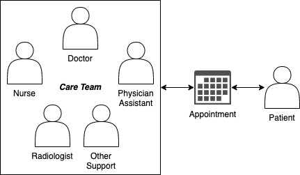

*Example care team for a patient*

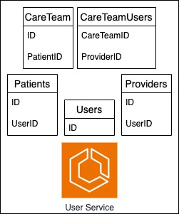

*Example data model for users, patients, providers, and care teams*

There are likely additional wrinkles in a technical design that a care team concept brings. Messaging is a good example:
* A patient messages their care team and that message thread gets a notification. One provider on that care team reads the message.
* Is that message considered read by the entire care team? Just the provider that read the notification? 

There are discussions with product partners which dictate who gets notified (and when!), what  the satisfactory states of a care team's response are to a patient, and if you as an implementer need to think about fan outs, queues, scheduled jobs, etc. 
#### Permissioning for care teams
It’s somewhat intuitive to identify and model providers as subtypes of users, and doctors, nurses, etc. as subtypes of providers. In my experience, this easily results in adopting a primitive [RBAC](https://www.okta.com/identity-101/role-based-access-control-vs-attribute-based-access-control/) model and subsequent [role explosion](https://www.permify.co/post/role-explosion/) problems. A couple of examples of permissioning between different types of providers:
* Mental health. Most provider roles have access to all patient notes. Mental health records, however, are privileged and need to be accessible only by specific types of providers (i.e. psychiatrists and psychologists).  
* Prescriptions. Medical scribes cannot prescribe drugs; physician assistants / registered nurses / nurse practitioners permissions to prescribe vary by state; doctors can prescribe, but certain controlled substances can only be prescribed by doctors with a DEA license

Wow! Can you imagine handling that with just a `type` attribute on your `Provider` data model? Given that user IAM needs will evolve and integrate with more sophisticated 3rd party solutions (e.g. Okta, Cognito), we should consciously consider RBAC/[ABAC](https://www.okta.com/blog/2020/09/attribute-based-access-control-abac/) tradeoffs and usage of modern techniques such as JWT claims for permissioning. 
### Laboratory results
Measurements are the bread and butter of science and probably a critical component of your healthcare application. Lab results are as close to the gold standard of measurements as you’ll get in a clinical setting. These specific and measurable data points are used by clinicians to diagnose and make decisions, to inform patients, and which the (state) government has its watchful eyes on.
#### Consuming lab results
An application or feature may be a downstream consumer of lab data, after-the-fact from some other data source. In such a setting, the actual contents of the lab result and its analysis are of interest. Consider some questions about what is a measurement from a lab result and how you want to model it: 
* Scalar? Range? Percentage? 
* How about units? (Maybe [UCUM](https://ucum.org/)) 
* How can those results (especially in different units) be compared? 
* 100% chance your providers / patients / insurance / some executive will want to visualize/chart/graph it all. 

Leveraging standard terminologies such as LOINC are helpful to aggregate results of the same type. Receiving this data is dependent on the performing laboratory’s laboratory information management system ([LIMS](https://en.wikipedia.org/wiki/Laboratory_information_management_system)), but we should encourage labs to perform at a higher standard for the benefit of both patients and providers. 
#### Placing lab orders
An application may be responsible for not just processing lab data, but also placing lab orders, recording samples, and asking questions. Integrating with a lab vendor in the U.S. can be complex; some may be using a bespoke API, others may be using more standard integrations such as HL7 message format. Many lab orders require that questionnaires for the patient and their answers be included (aka "Ask on Order Entry" or "AOE"). An implementer must consider how to maintain a Q&A system, extract associated patient demographic, insurance, provider and clinic information, transform the data to create the appropriate message bundle, and the delivery of said message to the recipient system. 

Additionally, that application that sends orders will likely need to process the results sent back by the laboratory. Processing these messages asynchronously is a good consideration, which will make this resemble more classic async message processing designs. There are still other technical challenges to consider such as patient identity matching, provider review and triage of (abnormal) results, and notification of both provider and patient. 

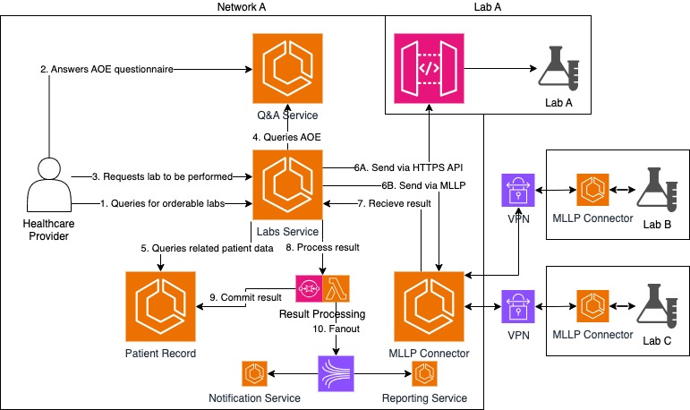

*Typical EHR laboratory order and result workflow*

### Imaging
X-rays, CT scans, MRIs; there are loads of pictures in the world of healthcare. There are some unique considerations when it comes to working with imaging, primarily around the medical devices that may be used on-site and the large image files (i.e. [DICOM](https://en.wikipedia.org/wiki/DICOM)) that are generated. 

X-ray machines often need to interface with a local computer (usually a PC). This presents the need for installation, maintenance, networking, and troubleshooting of that software. Unless a radiologist is employed on-site, the generated DICOM images are sent to be read elsewhere (i.e. teleradiology). Seamless scheduling for ordering imaging requests may involve integrating with a [modality worklist](https://en.wikipedia.org/wiki/DICOM#Modality_worklist).

DICOM images often end up in [MB sizes](https://www.researchgate.net/figure/File-sizes-of-images-from-different-imaging-modalities_tbl1_26831435), which present challenges on any machines that need to handle the transfer or storage of those images. In today's modern cloud-hosted infrastructure, these storage needs are an important consideration separate from the compute-related needs of your application. 
### Prescriptions
It's pretty hard to talk about (e-)prescribing without talking about [Surescripts](https://surescripts.com/). So much so, that there's not much more to be said other than getting down to work and implementing their XML-based API and workflows. There have been many [SCRIPT](https://en.wikipedia.org/wiki/SCRIPT_(medicine)) versions, but v2017071 is the mandated way to go.

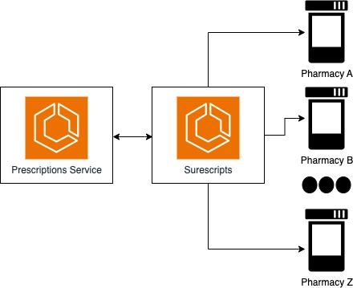

*Say there’s a monopoly without saying there’s a monopoly*

It is worth mentioning that workflows are best implemented as asynchronous workflows (despite some pharmacies responding synchronously). As in any request/response system, you need to be prepared to handle a variety of situations from periodic outages in the network of recipients, to repeated or unsolicited messages, and a manner of other unforeseen issues.
#### Drug Safety
Prescribing drugs in the US is a big deal, but with great power comes great responsibility; your application needs to keep patient safety in mind. This may include cross-checking a patient's allergies against ingredients in a prescribed medication or ensuring that drug-drug interactions are safe. There are entire database products that help provide this kind of information such as [First Databank](https://www.fdbhealth.com/) or [Medi-span](https://www.wolterskluwer.com/en/solutions/medi-span). It may feel frustrating to attach your application so tightly to a vendor, but I'm not currently aware of a good way to derive this information from any open source or public data. 
### Data Interoperability
#### eMPI / Patient Matching
U.S healthcare is a world without hard identifiers; there is no requirement that patients must provide SSN to their healthcare provider. This lack of hard identifiers becomes painfully apparent once your healthcare application interacts with any other system. The need for your application to handle patient matching may not be immediately apparent, but in my experience it is an inevitability as your needs mature.

Consider the below example of a patient record in your application, `Patient Record A`. You receive an unsolicited lab result from your lab vendor, with no accession number to match a lab request to, but with the following patient demographic information in `Lab Result B`. Do you match and store the lab result under the patient record? 

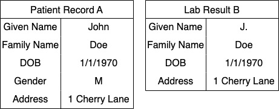

*Example demographics of a patient record and demographic of an inbound lab result*

Imperfect demographic data in the healthcare space is the norm, with partial data or simple misspellings being common. The above example may seem like a sure match, but there are always edge cases such as fraternal twins:

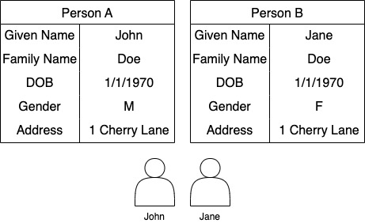

*John Doe and Jane Doe, fraternal twins that live at the same address*

While these edge cases may seem like small mistakes, the exposure of healthcare data is a breach of PHI and HIPAA covered entities are [required to report these breaches](https://www.hhs.gov/hipaa/for-professionals/breach-notification/index.html). Failing to account early for these matching problems in an application represents both risk to the business and more work for engineering.

More generally speaking, patient matching (essentially a [record linkage](https://en.wikipedia.org/wiki/Record_linkage) problem) is an important piece of maintaining a coherent patient record. Unfortunately, without hard identifiers patient matching will inevitably result in false positives (or false negatives). At face value, what seems to be a data science / modeling problem actually belies the need of an organization to have a much more fleshed out set of features. 

It may be helpful to look at the concept and feature set of an [eMPI](https://en.wikipedia.org/wiki/Enterprise_master_patient_index) and work backwards to understand future requirements. 
#### Data sharing
Working with partner health systems means sharing. Sometimes that will mean an HL7 feed about things like patient admissions. Other times, that means integrating with a data sharing network such as a local/state [HIE](https://www.healthit.gov/topic/health-it-and-health-information-exchange-basics/health-information-exchange), [Carequality](https://carequality.org/), or [Commonwell](https://www.commonwellalliance.org/). 

The barrier of entry to these data exchanges can be high, requiring implementation of often esoteric standards and frameworks (e.g. [ITI-55](https://profiles.ihe.net/ITI/TF/Volume2/ITI-55.html)). There are a host of vendors that offer services to help bridge the gap and connect you to these networks. 

Some considerations to keep in mind: 
* Participating in these networks is a two-way street, to get data you have to give data, so reciprocation is required
* Not every vendor is going to host your data to respond to requests, so transformation to a standard such as FHIR may be a prerequisite. 

#### Referrals
Similar to prescriptions, gone is the day of paper referrals. Electronic referrals can be sometimes handled through implementing [360X](https://oncprojectracking.healthit.gov/wiki/display/TechLab360X/360X+Implementation+Guide).

The ability to generate C-CDA documents, HL7 messages, and provide Direct Messaging are all pre-requisites.
### Compliance / Public Health
The common theme for these is essentially that if you provide care, public health agencies (your local / state government) care about what you are doing. 

#### Case Reporting
[AIMS Platform](https://ecr.aimsplatform.org/) is one way to meet this requirement; it's very helpful to have data available on a FHIR server to make this work. 
#### Electronic Lab Reporting
Each state has their own state agency that handles the reporting of lab results for the interest of public health; primarily communicable diseases (such as STIs). 

The classic way is to integrate with each state individually, which usually boils down to an SFTP connection per state. 

Spending the time to onboard and integrate with every state a provider operates in may or may not be appealing to you, let alone maintaining up to 50 different SFTP connections for this purpose. 

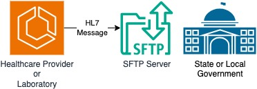

*Do this ⌈50⌉ times (and maintain it!)*

There are some vendors (e.g. [Redox](https://www.redoxengine.com/), [Ironbridge](https://www.ironbridgecorp.com/), [Datapult/AIMS](https://www.aphl.org/programs/informatics/Pages/ELR.aspx)) which will aggregate some of these problems away from you as a single point of integration.
#### Vaccination Reporting
Almost the same as the above, but worth noting that vaccine registries may be at various levels of locality (e.g. state, county, city).

### HIPAA & PHI
Working in healthcare is a highly regulated environment, which will impact building any applications. The levels of how much of a problem PHI for your day-to-day can cause depends on a variety of factors that may include: what kind of healthcare application you build, what your services' relationship to a patient is, if your vendor can support healthcare data, etc.
#### Vendors
If you use a vendor that doesn't have a [BAA](https://www.hhs.gov/hipaa/for-professionals/privacy/guidance/business-associates/index.html) agreement with you, that vendor shouldn't have any exposure to patient data. For example, this can be very problematic when you consider vendors that help you handle application logging or monitoring. Some may only offer a BAA at a higher pricing tier (e.g. [Sentry](https://sentry.io/trust/privacy/)), with specific limitations (e.g. [NewRelic](https://docs.newrelic.com/docs/security/security-privacy/compliance/hipaa-readiness-new-relic/), [Datadog](https://docs.datadoghq.com/data_security/logs/#hipaa-enabled-customers)), or under certain conditions (e.g. [AWS](https://docs.aws.amazon.com/whitepapers/latest/architecting-hipaa-security-and-compliance-on-aws/encryption-and-protection-of-phi-in-aws.html)).

Your life will be easier if your vendors have BAAs. It's probably worth the extra money compared to the engineering work you'd put into trying to remove all possible avenues of leakage.
#### Access & Data Controls
Access controls will be mandatory and proliferating production data back into a lower test/staging environment is a big no-no. It’s extremely unhygienic to have patient data on your local machine and it’s generally considered a serious legal issue to have any data leave the U.S.

That means that any teams working abroad shouldn’t be accessing PHI, or should be only interacting with PHI as part of their duties on physical hardware that’s located domestically. 
#### Testing
In many other industries it may be an option to pull a production snapshot or subset into a lower environment. In healthcare, I would strongly encourage building a strong testing culture, where as many scenarios and workflows can be simulated through automation. 

Healthcare data and scenarios are messy and complicated, including reflections about how insurance coverage works, who has access to their (and their dependents’) data, unique medical considerations such as allergies, etc. It’s critical to make it easy to construct these scenarios for simulation and lower the barrier to entry for good code coverage. 

Throughout the years I have a personal fondness for [Synthea](https://github.com/synthetichealth/synthea), which generates synthetic patient data in FHIR format. While there may be no need to incorporate new, random populations as part of your CI/CD pipeline, it can be a helpful tool to seed some static patient data for testing purposes.
## The Technical Bits
While some of you may find this part familiar (or dry), I'll go over some of the building blocks that you'll encounter working in the healthcare world.
### Messaging Formats
These data formats are used ubiquitously across the healthcare space. It is guaranteed you will encounter them the longer you spend time working in this domain.
#### (C-)CDAs
Clinical Document Architecture ([CDA](https://en.wikipedia.org/wiki/Clinical_Document_Architecture)) and Consolidated Clinical Document Architecture ([C-CDA](https://en.wikipedia.org/wiki/Consolidated_Clinical_Document_Architecture)) are XML-based markup standards commonly used in the exchange of healthcare records. Given that all certified EHRs are required to export data in C-CDA format, these documents are very commonly encountered. 

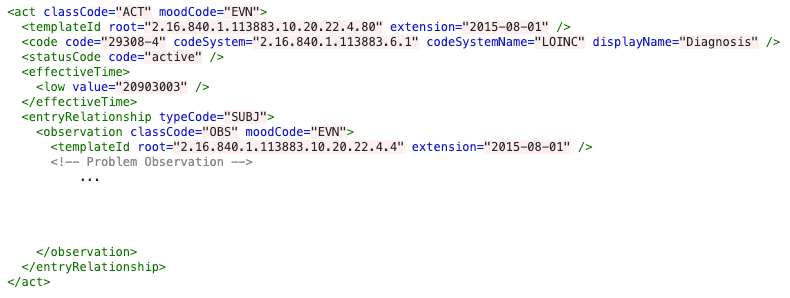
*An example of an Encounter Diagnosis (from [HL7.org](https://cdasearch.hl7.org/examples/view/Guide%20Examples/Encounter%20Diagnosis%20%28V3%29_2.16.840.1.113883.10.20.22.4.80))*

Despite being a standard, practically speaking there are many small variations in the content of the data that make parsing and strict typing difficult. 

It is likely that you or your end users may want to view C-CDAs in a more human readable fashion. There are a number of publicly available solutions. Here’s the 2016 winner of a CCDA rendering challenge hosted by the HL7 organization ([GitHub](https://github.com/brynlewis/C-CDA_Viewer), [website](https://backbeachsoftware.com.au/challenge/index.htm)). 
#### HL7 Messaging
There are multiple versions of HL7 Messages, but practically speaking it is only worth discussing [v2.x](https://www.hl7.org/implement/standards/product_brief.cfm?product_id=185). HL7v3 does exist, but I have never seen a partner use it in practice (and it will probably [never gain adoption](https://www.intelliware.com/hl7-games-catching-fhir/)). I have also never encountered a partner that used a version of HL7 v2 below v2.3.1. 

[HL7 v2 message format](https://en.wikipedia.org/wiki/Health_Level_7#Version_2_messaging) is a multi-line, pipe delimited format. It is annoying to work with directly, and would be best to work with a utility (e.g. [HAPI](https://hapifhir.github.io/hapi-hl7v2/), very popular for Java-users) to abstract the (de)serialization of your data model to the message format.

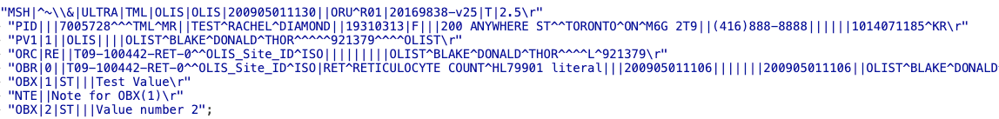
*Example HL7 Message (from [HAPI FHIR docs](https://hapifhir.github.io/hapi-hl7v2/xref/ca/uhn/hl7v2/examples/HandlingMultipleVersions.html#L173))*

There are many different types of HL7 messages, but in practice I find ADTs (patient admin/transfer/discharge), ORMs (orders), and ORUs (observations/results) to be most common. 

The specific contents of what each vendor populates into each segment can vary, so it is important to account for that variability (e.g. sending “Self” vs “SEL” vs “S” on insurance coverage) in parsing these messages.

HL7 messaging lends itself very well to asynchronous message processing, potentially with fanning out downstream. Many use cases for these data types do not require a user to immediately take action on them. As an example, the results of a patient’s blood work do not need to be reacted to immediately, they can be processed as compute resourcing allows (or scaled up as appropriate), which can generate notifications to patients/providers to view when they are available. Queues and streams are your friends here.
#### FHIR
Fast Healthcare Interoperability Resources ([FHIR](https://fhir.org/)) is a new standard more in-line with modern RESTful, resource-based approaches to accessing information. As a healthcare provider organization, being able to produce FHIR resources or being capable of putting up a fully functional FHIR server addresses many of your healthcare interoperability needs.

While adoption of FHIR has been spotty in my time, the landscape has been changing, with [60%+ clinicians and 80%+ hospitals in the US adopting a FHIR compliant EHR](https://www.healthit.gov/buzz-blog/health-it/the-heat-is-on-us-caught-fhir-in-2019). At the end of 2022, [ONC's Cure Act Final Rule](https://www.healthit.gov/topic/oncs-cures-act-final-rule) also requires that certified EHRs provide FHIR APIs that minimally provide data specified by [USCDI](https://build.fhir.org/ig/HL7/US-Core/uscdi.html). In practice over the last few years, increasing numbers of vendors are also more actively working with FHIR APIs.
### Architecture Patterns
#### Flat file ingestion
The truth is that a huge part of healthcare, even in 2024, is still powered by flat files (CSV, TSV, etc.). These could come in the form of membership/roster files, claims files, compendiums for orders (e.g. labs, x-rays), to name a few. You need to be comfortable in parsing, handling, and generating this kind of data; if you're lucky you'll be doing it on the scale of hundreds of thousands of records per month. 

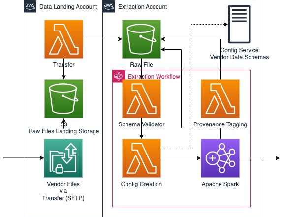

*Generic system design of an automated flat file ingestion process*

These are classic big data processing problems and thinking about them as such is helpful. 
#### HL7 Integrations
HL7 messages are great, but how are they actually transmitted? The standard way to integrate is through a TCP/IP protocol called [MLLP](https://docs.oracle.com/cd/E19509-01/820-5508/ghadt/index.html). MLLP is unfortunately an unencrypted protocol, which does not lend itself well to healthcare data security or usage over the open web. As such, trading MLLP with another partner often involves setting up a VPN between your network and theirs. Some networking knowledge is helpful to make this all work in our modern, cloud-based, virtual network, virtual machine world. 

Additionally, it's also popular to use another piece of software (an OSS option is [MirthConnect](https://github.com/nextgenhealthcare/connect), though I’ve never personally integrated with it) to deal with the pains of actually working with the MLLP protocol and relay an HL7 message over something more familiar like HTTP. The sad truth is that many companies are marshaling their data into HL7, sent over via HTTP to an MLLP connector to send over via VPN to a partner which will simply do the same thing in reverse.

Another common option is to send HL7 over SFTP. Ultimately, HL7 messages are just a format standard, so the secure transmission of those messages is up to both parties integrating with each other. 

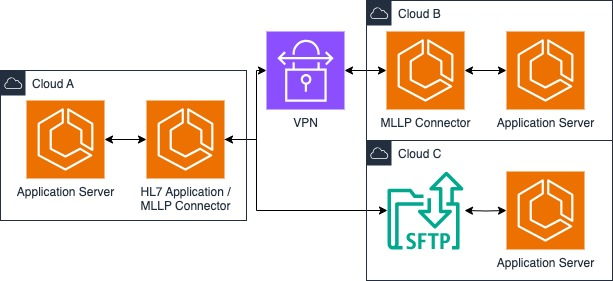

*Typical design of an HL7 transmission for multiple partners*
#### Ordering and Resulting
A daily workflow in a clinical setting is the act of ordering a diagnostic test or study. Therefore, multiple healthcare applications and workflows will follow this model.

There is first a compendium of available orders (e.g. blood test, urine test), which is loaded into a database, searchable and selectable by a clinician. An order is bundled (along with patient demographic information, insurance information, etc.) as part of a request to the entity servicing that diagnostic test or study.

Once the order is serviced by that entity and the request is completed, the diagnostic test or study is resulted back to the system that originally placed the order. This may in turn trigger some downstream processes as a reaction to that result. 

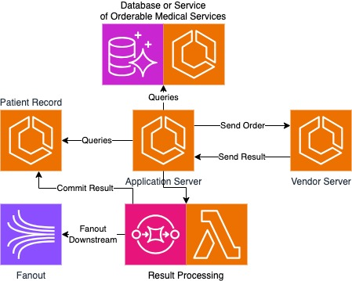

*Generic ordering / resulting process*

#### Terminology Services
There are a lot of vocabularies in the healthcare space, which are often referred to as “terminologies”. These cover a variety of domains such as diagnoses, billing codes, medications, labs, etc. 

It's my strong belief that any successful healthcare technology stack requires a good grasp of multiple terminologies to allow for the structured storage and reference of healthcare data. While this does not strictly need to be a [FHIR Terminology Service](https://build.fhir.org/terminology-service.html), it is at least a good resource to draw inspiration from. 

The Unified Medical Language System ([UMLS](https://www.nlm.nih.gov/research/umls/index.html)) is a great resource that aggregates many of these important terminologies. In my experience, some of the most common and critical are ICD-10, SNOMED CT, CPT, LOINC, NDC, and RxNorm. 

If your healthcare application does not have the ability to codify these medical concepts into a single standard and machine readable way, it is very difficult to aggregate and reason about your data to the end user. Additionally, many standards expect that your application can communicate in these terms. 
##### Terminology Mapping
[Cross-mapping](https://www.nlm.nih.gov/research/umls/knowledge_sources/metathesaurus/mapping_projects/index.html) between different terminologies is often desired, with mapping efforts progressing greatly since my exposure to initial mappings in 2016. 
## Conclusion
Wow! You made it all the way. I hope that if you’ve read this far (or skipped to the end) that this has been helpful to you in some small way. Working in healthcare is hard; a highly regulated environment, ingrained industry players and competitors, and seemingly arcane feature requirements. But beyond all of that, I want you to know that the **technical problems are solvable**. 

While many of the applications included here represent needs in a larger (EHR) context, there are plenty of opportunities to decompose these needs into smaller service offerings; service offerings that may one day disrupt the industry. Hopefully reading this has brought the barrier to making a real impact in U.S. Healthcare that much lower.

I’d be remiss to not say that there is real reward in working in healthcare tech. The industry is broken for both patients and the providers working on the frontlines of giving care. Some of my most memorable moments have been visiting clinics powered by our technology, seeing and hearing the gratitude of healthcare providers who already have a complex and difficult job to do, making their lives that much easier to care for patients. If you have learned or enjoyed reading this, I ask for nothing in return but for you to work towards bettering the lives of those most deserving people. 

### Acknowledgements
Thank you to everyone who has contributed to my technical career and knowledge (notably):
* Greg Chang and Sameer Tanakia, who took a chance with me at forMD
* The IBM EMRA group (Benjamin Segal and Partha Suryanarayanan, who I both learned a lot from, Daniyar Yeralin, Phillip Godzin, Weina Chen, and Maochen Guan, who I worked the most with)
  * Especially **Phillip Godzin**, who helped edit this
* Haven Healthcare engineering (Misha Kaletsky and Ahmet Nalcacioglu, rockstar engineers and mentors, my co-tech lead Reagan Elm, close colleague Pablo Fuentes, and supportive managers Stephanie Tam and Yvette Pasqua)
* My Carbon Health engineering team (Min Weng, Atilla Acar, Talha Sen, Fatih Can Kurnaz, Oğuzhan Karakahya, Chris Hennen, Kyle Tilman, Ariel Barnoy) and manager Meng Lay
